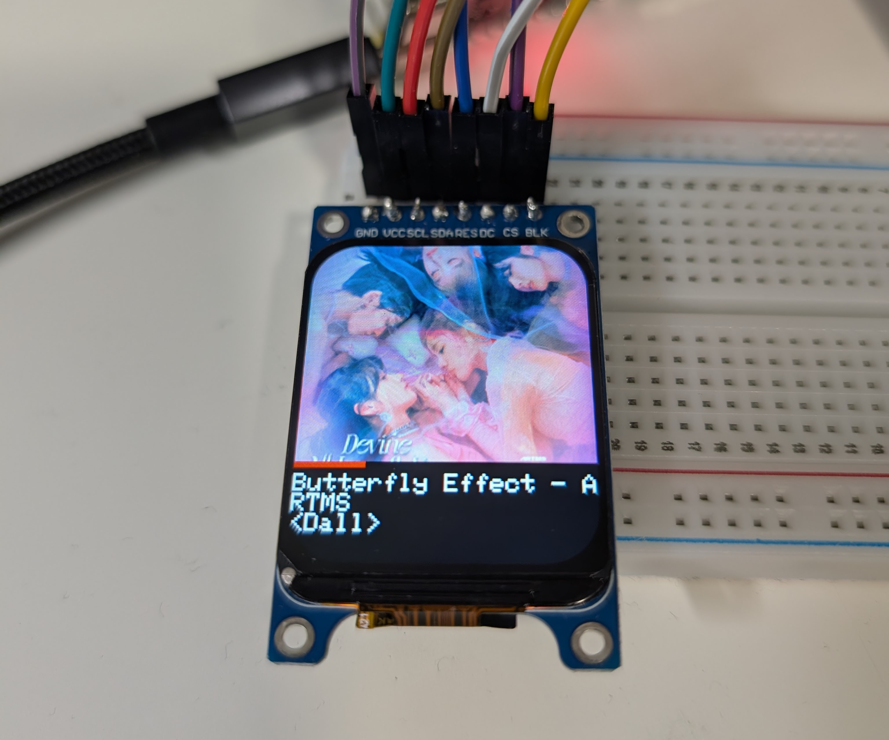

# desk-thing

An ESP32-controlled media display and controller.

## what this does differently

- desk-thing sources global data from a Windows session
    - Includes YouTube, Spotify, local, etc.
    - No need for individual APIs (RIP Spotify)
- Event-driven through native Windows API (`PyWinRT`)
- Common packet structure for later integration with WiFi, BLE, etc.

## features

### 01-06-26
- One-way communication from Windows to ESP32
    - Media changed, playback status, timeline
- Through serial